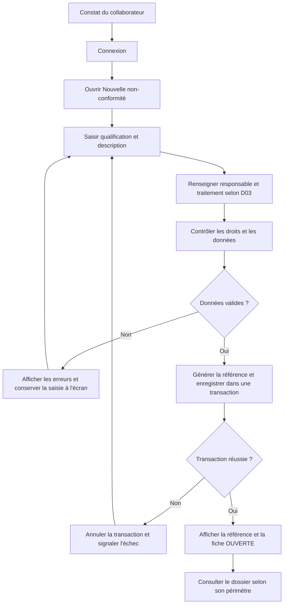
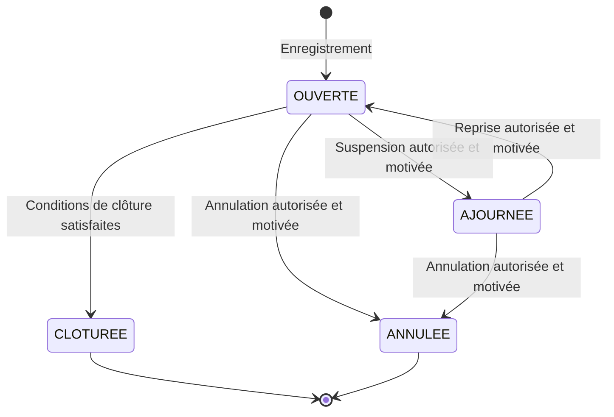

# Processus proposé : enregistrer et suivre une non-conformité

## Fiche du processus

| Élément | Définition proposée |
| --- | --- |
| Déclencheur | Un collaborateur constate un problème relevant de la qualité d'un service ou d'un processus. |
| Entrée | Constat, qualification et données de prise en charge disponibles. |
| Fin du premier parcours | NC enregistrée, référencée et consultable dans le périmètre autorisé. |
| Fin du cycle complet | NC clôturée après les vérifications requises, ou annulée avec justification. |
| Déclarant | Collaborateur connecté qui enregistre le constat. |
| Responsable de traitement | Personne désignée pour réaliser et documenter le traitement. |
| Validateur | Personne habilitée pour une étape et un niveau, selon D07 à D10. |
| Administrateur | Prépare les données et accès ; ses pouvoirs métier dépendent de D06. |

Ce processus est une **proposition — D01**. Le cycle complet dépasse le premier
lot d'enregistrement/consultation. Il ne présume pas que le déclarant, le
responsable et le validateur soient nécessairement trois personnes différentes.

## Premier parcours : enregistrement et consultation

La conservation de la saisie en cas d'erreur reste dans l'écran ; elle ne crée
pas un dossier en base. Aucun statut `BROUILLON` n'existe actuellement. Une
sauvegarde persistante de brouillon serait un besoin supplémentaire à concevoir.

| Étape | Acteur | Contrôle proposé | Données / effet |
| --- | --- | --- | --- |
| 1. Accéder | Collaborateur | Compte valide et droit de création. | Identité issue de la session, jamais saisie librement. |
| 2. Qualifier | Déclarant | Processus, type et nature de service existants et actifs. | Identifiants des référentiels et description. |
| 3. Préparer | Selon D03 | Responsable autorisé et traitement non vide. | Responsable, traitement, échéance selon D04. |
| 4. Vérifier | Application | Règles R01 à R07, avant tout enregistrement. | Erreurs compréhensibles, sans perte de saisie. |
| 5. Créer | Application | Génération de référence, insertion NC et audit cohérents. | NC `OUVERTE`, référence unique, acteur et dates. |
| 6. Confirmer | Application | Succès affiché uniquement après validation de la transaction. | Fiche du dossier, lien vers la liste. |
| 7. Consulter | Déclarant/responsable | Autorisation vérifiée pour chaque dossier. | Lecture du contenu et historique autorisé. |

## Règles du premier parcours

Ces règles sont proposées sauf les contraintes SQL explicitement signalées.

| ID | Règle | Fondement / décision |
| --- | --- | --- |
| R01 | Vérifier l'identité, le profil et le périmètre pour chaque opération ; un bouton masqué ne suffit pas. | Proposition ; D05/D06. |
| R02 | Respecter types, longueurs, nullabilité et clés étrangères ; refuser les textes obligatoires vides et les valeurs trop longues sans troncature. | Contraintes SQL + contrôles applicatifs proposés. |
| R03 | Proposer uniquement les référentiels actifs pour une nouvelle NC ; un élément désactivé reste lisible dans les anciens dossiers. | Proposition ; indicateurs `actif` existants. |
| R04 | Exiger responsable et traitement dès l'insertion tant que le modèle reste celui du SQL ; ne pas remplir avec une valeur fictive. | Constat `NOT NULL` ; sens métier D03. |
| R05 | L'échéance, si renseignée, ne précède pas la date de création. Renseigner la date de création automatiquement sauf règle contraire confirmée. | Contrainte SQL ; D04 pour obligation et rétroactivité. |
| R06 | Déclarant, référence, statut initial et horodatages sont contrôlés par l'application. | Proposition ; référence unique et défaut `OUVERTE` existants. |
| R07 | Génération du compteur et insertion utilisent la même connexion et transaction. Inclure l'audit de création dans cette transaction. | Usage documenté de la procédure + proposition de cohérence de l'audit. |
| R08 | Le double clic ne doit pas créer deux dossiers identiques ; définir aussi le traitement d'un réessai après une réponse réseau perdue. | Proposition ; D13. |
| R09 | Ne pas déduire une décision « pas d'action corrective nécessaire » du seul défaut `FALSE`. | Constat technique ; D04/D12. |

## Cycle complet après l'enregistrement

1. **Examen** : vérifier qualification, affectation et traitement envisagé. Une
   correction peut être demandée avec un motif. Si une validation formelle est
   requise, enregistrer une décision propre au dossier.
2. **Traitement** : le responsable réalise et documente le traitement. Les
   changements de responsable, d'échéance et de contenu sont historisés.
3. **Action corrective** : déterminer son besoin. Si elle est nécessaire,
   analyser les causes et créer ou associer une action selon D12. Aucune action
   n'est générée automatiquement sur la seule valeur du booléen.
4. **Vérification** : contrôler le traitement, puis l'efficacité si elle est
   requise. Un résultat insuffisant retourne le dossier au traitement.
5. **Clôture** : l'acteur habilité vérifie les conditions de D11/D12 et clôture
   le dossier. La date de clôture et l'événement d'audit sont enregistrés.

Ces étapes fonctionnelles ne sont pas de nouveaux codes de statut. Une NC
`OUVERTE` peut être en examen, en traitement ou en vérification. Leur suivi
précis et les validations demandent un stockage complémentaire si retenus.

## Statuts et transitions

**Constat :** les quatre statuts suivants sont préchargés dans le
[script des référentiels](../../database/002_seed_referentiels.sql). Les deux
statuts finaux sont `CLOTUREE` et `ANNULEE`. La base ne contrôle pas les transitions.

Le diagramme est proposé et dépend de D06/D11. Il n'autorise pas, à ce stade,
la réouverture des dossiers finaux ; cette possibilité reste à décider.

| Transition | Condition proposée | Trace attendue |
| --- | --- | --- |
| Création → `OUVERTE` | Règles de création satisfaites. | Auteur, données initiales, référence et date. |
| `OUVERTE` → `AJOURNEE` | Acteur habilité et motif explicite. | Ancien/nouveau statut et motif. |
| `AJOURNEE` → `OUVERTE` | Acteur habilité et motif de reprise. | Ancien/nouveau statut et motif. |
| `OUVERTE` → `CLOTUREE` | Vérifications et validations requises satisfaites, règles des actions liées appliquées. | Décision, date de clôture et historique. |
| `OUVERTE`/`AJOURNEE` → `ANNULEE` | Acteur habilité et justification. | Décision d'annulation, acteur, date et motif. |

Un refus de validation n'est pas une annulation automatique. Une vérification
`NON_OK` ne crée pas un nouveau statut. Les règles de verrouillage ou de
correction des dossiers clôturés/annulés dépendent de D11.

## Exceptions et traçabilité

| Situation | Comportement à concevoir |
| --- | --- |
| Aucun responsable éligible | Informer l'utilisateur ; ne pas inventer une affectation. Résoudre D03/D14. |
| Référentiel désactivé pendant la saisie | Revérifier à l'enregistrement et demander une sélection valide. |
| Compte arrivé à expiration | Refuser la nouvelle opération et demander une reconnexion appropriée. |
| Échec de transaction | Annuler compteur, création et audit ; ne pas afficher de succès. |
| Réponse perdue après validation de la transaction | Distinguer résultat inconnu et échec confirmé ; éviter la recréation aveugle selon D13. |
| Validateur absent ou non habilité | Aucune validation automatique ; définir remplacement ou attente selon D08/D10. |
| Modification concurrente | Signaler un conflit avant d'écraser le travail d'une autre personne ; stratégie à choisir au lot de modification. |

Utiliser `journal_audit` pour les opérations : création, modification,
réaffectation, changement d'échéance, transition et association d'action.
L'audit conserve acteur, date, entité, identifiant, valeurs avant/après et motif
de l'opération quand applicable. Les motifs peuvent être portés dans les données
JSON de l'événement ; aucun champ de motif dédié n'existe sur la NC.

Ne pas journaliser de mot de passe ou de hash. Les décisions de validation
doivent aussi être consultables par dossier et par niveau si le circuit est
retenu. L'audit et `updated_at` ne remplacent pas ce suivi structuré.
