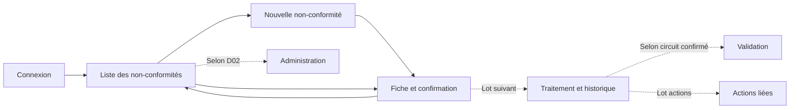

# Écrans, données et organisation technique

Tous les écrans décrits ici sont **à développer**. Leur visibilité et leurs
actions dépendent de la [matrice de permissions](03-profils-validation.md).
Aucune technologie frontend ou backend n'est choisie par ce document.

## Navigation proposée

## Écrans du premier lot

| Écran | Contenu et actions | États à prévoir |
| --- | --- | --- |
| E01 — Connexion | Identifiant selon la convention RH retenue, mot de passe, action Se connecter ; déconnexion disponible une fois connecté. | Chargement, identifiants incorrects, compte hors validité, accès autorisé. |
| E02 — Liste des NC | Référence, processus, type, responsable, création, échéance, statut ; filtres référence/processus/statut/responsable dans le périmètre permis ; pagination ; Nouvelle NC selon droits. | Liste vide, chargement, résultats, erreur de consultation. |
| E03 — Nouvelle NC | Qualification, constat, prise en charge, échéance ; Enregistrer et Annuler. | Champs requis, erreurs par champ, enregistrement en cours, échec, succès. |
| E04 — Fiche NC | Référence et statut, identité du déclarant, qualification, description, traitement, responsable, dates et audit de création autorisé. | Lecture autorisée, accès refusé, dossier absent. |

Une confirmation intégrée à E04 affiche la référence après succès. L'interface
utilise les libellés métier, explique les erreurs et marque les champs requis.
Elle ne présente pas les noms de tables ou le fonctionnement transactionnel
comme des choix à faire par le collaborateur.

## Organisation du formulaire E03

1. **Qualification** : processus, type de NC, nature de service.
2. **Constat** : description du problème.
3. **Prise en charge** : responsable et traitement, selon D03.
4. **Planification** : échéance et informations de création en lecture seule.
5. **Actions** : Enregistrer ; Annuler, avec avertissement si des données saisies
   vont être perdues.

Après erreur, conserver les valeurs à l'écran. Pendant l'enregistrement, éviter
les soumissions répétées ; cela ne remplace pas la protection contre les réessais
côté serveur à définir dans D13. Aucun brouillon persistant n'est annoncé.

## Dictionnaire de la NC : types existants

Source : [table `non_conformites`](../../database/001_schema.sql). Les contraintes
SQL et les règles de formulaire sont volontairement distinguées. `NOT NULL`
n'interdit pas à lui seul une chaîne vide.

| Colonne | Type exact | Nullabilité / défaut SQL | Usage proposé |
| --- | --- | --- | --- |
| `id` | `INT UNSIGNED` | Non nul, auto-incrément | Identifiant interne, jamais saisi. |
| `reference` | `VARCHAR(50)` | Non nul, unique | Générée ; format et stabilité selon D13. |
| `processus_id` | `INT UNSIGNED` | Non nul, FK `processus.id` | Sélection d'un processus actif. |
| `type_nc_id` | `INT UNSIGNED` | Non nul, FK `types_nc.id` | Sélection d'un type actif. |
| `nature_service_id` | `INT UNSIGNED` | Non nul, FK `natures_service.id` | Sélection d'une nature active. |
| `enregistree_par_matricule` | `VARCHAR(60) COLLATE utf8mb4_bin` | Non nul, FK `pers.matricule` | Compte connecté. |
| `description` | `TEXT` | Non nul | Constat non vide proposé. |
| `traitement` | `TEXT` | Non nul | Sens et auteur à confirmer dans D03. |
| `responsable_matricule` | `VARCHAR(60) COLLATE utf8mb4_bin` | Non nul, FK `pers.matricule` | Personne éligible selon D03/D06. |
| `date_creation` | `DATE` | Non nulle | Date métier ; automatique sauf D04. |
| `date_echeance` | `DATE` | Nullable, défaut `NULL` | Obligation métier selon D04 ; si présente, supérieure ou égale à la création. |
| `date_cloture` | `DATE` | Nullable, défaut `NULL` | Renseignée à la clôture ; supérieure ou égale à la création. |
| `statut_code` | `VARCHAR(20)` | Non nul, défaut `OUVERTE`, FK `statuts.code` | État contrôlé par une transition métier. |
| `verification_traitement_code` | `VARCHAR(20)` | Nullable, défaut `NULL`, FK | Suivi : `OK` ou `NON_OK`. |
| `action_corrective_necessaire` | `BOOLEAN` | Non nul, défaut `FALSE` | Décision selon D04/D12, pas une preuve d'examen par défaut. |
| `analyse_causes` | `TEXT` | Nullable, défaut `NULL` | Suivi ; obligation éventuelle selon D11/D12. |
| `evaluation_efficacite_code` | `VARCHAR(20)` | Nullable, défaut `NULL`, FK | Suivi : `OUI`, `PARTIELLE`, `NON`. |
| `created_at` | `TIMESTAMP` | Non nul, défaut `CURRENT_TIMESTAMP` | Horodatage technique de création. |
| `updated_at` | `TIMESTAMP` | Non nul, mise à jour automatique | Dernière modification ; pas un historique complet. |

L'application doit respecter la capacité réelle de `TEXT` dans le jeu de
caractères choisi, sans lui attribuer une longueur de `VARCHAR` inventée.
Toute limite métier supplémentaire doit être explicitement spécifiée. Les
matricules sont des chaînes : conserver les zéros initiaux et leur collation.

Si « action corrective non encore examinée » doit devenir une valeur distincte
de oui/non, le booléen actuel ne suffit pas. Cette évolution dépend de D04 et
ne doit pas être simulée en interprétant arbitrairement `FALSE`.

## Données voisines à préserver

| Données | Contraintes existantes à respecter |
| --- | --- |
| Personnel | `pers.matricule` et matricules de liaison : `VARCHAR(60)`, collation binaire. `pers.nom_prenom` : `VARCHAR(60)`. |
| Compte | `acces.nom` : `VARCHAR(60)` ; `passe` : `VARCHAR(255)` ; début et fin en `TIMESTAMP`, fin nullable. Le champ de mot de passe reçoit un hash, jamais le mot de passe en clair. |
| Profils | Code `VARCHAR(30)`, libellé `VARCHAR(100)` ; association compte/profil existante. |
| Validation du personnel | `niv_val` : `VARCHAR(20)` ; `nom_prenom` : `VARCHAR(600)` ; `nom_valideur` : `VARCHAR(200)`. Ne pas harmoniser ces tailles sans revue de la source RH. |
| Processus | Code `VARCHAR(30)`, nom `VARCHAR(200)`, indicateur `actif`. |
| Types / natures / origines | Libellés `VARCHAR(255)` pour types et natures ; `VARCHAR(150)` pour origines d'action ; indicateurs `actif`. |
| Action | `reference` : `VARCHAR(50)` ; `initiee_par` : `VARCHAR(200)` libre, contrairement au déclarant matriculé d'une NC ; textes métier en `TEXT`. |
| Notifications | Type `VARCHAR(30)`, titre `VARCHAR(200)`, message `TEXT`, destinataire matriculé ; canal et règles d'envoi à définir. |
| Audit | Acteur matriculé nullable ; opération `VARCHAR(30)` ; entité et identifiant `VARCHAR(60)` ; valeurs avant/après en `JSON`, adresse IP `VARCHAR(45)`. |

La convention de connexion (matricule ou autre identifiant RH) relève de D14.
`acces.nom` n'a pas de contrainte d'unicité ; ne pas présumer qu'il constitue un
identifiant de connexion unique.

## Responsabilités techniques proposées

| Partie | Responsabilité |
| --- | --- |
| Interface | Afficher les données autorisées, guider la saisie, présenter erreurs et résultat. |
| Application serveur | Authentifier, autoriser, contrôler les règles métier, gérer la transaction et l'audit. |
| MySQL | Stocker, garantir clés étrangères et unicité, appliquer les contraintes de dates et gérer le compteur. |
| Source RH / import | Fournir personnel, comptes ou affectations selon D14 ; intégration non existante dans le dépôt. |

Le choix d'architecture ne change pas les contrats de données. Il sera possible
de choisir le framework après validation du parcours, sans inventer de services
ou de connexion RH déjà disponibles.

## Vérifications techniques avant développement

- Vérifier les scripts sur une base de recette, pas sur des données métier par défaut.
- Vérifier la validité des comptes avec `Date_Deb` et `Date_Fin`. La vue
  `v_personnel` contrôle la fin mais pas un début futur : son indicateur ne
  suffit pas à lui seul pour autoriser une connexion.
- Définir dans D13 le dépassement de 999 : le remplissage sur trois caractères
  de la procédure actuelle ne doit pas être considéré comme extensible.
- Confirmer la stratégie de réessai de création et de modification concurrente.
- Définir dates métier, horodatages et fuseau utilisé avant leur affichage.
- Limiter les données RH retournées aux écrans qualité ; la consultation d'une
  NC ne nécessite pas automatiquement l'adresse, la CIN ou les données de carrière.

## Écrans des lots suivants

| Écran | Objet | Dépendances |
| --- | --- | --- |
| E05 — Traitement | Mise à jour du traitement, résultats, échéance et historique. | D03/D06/D11 |
| E06 — Validation | Dossiers à examiner, décision motivée, niveau et historique du circuit. | D07 à D10, stockage complémentaire |
| E07 — Actions | Création d'une action indépendante ou liée, suivi et associations. | D01/D12 |
| E08 — Administration | Référentiels, comptes, profils et affectations selon périmètre retenu. | D02/D05/D14 |
| E09 — Pilotage | Retards, indicateurs et notifications définies. | D06/D14 |
