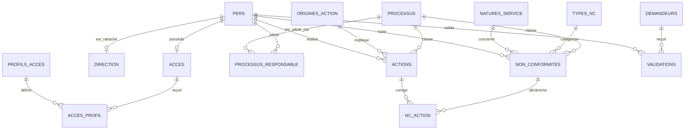

# Explication du modèle de données

## Ce que demandait la superviseure

La remarque signifie que le modèle des processus et des demandes peut être
conservé, mais que les personnes ne doivent pas être redéfinies dans une table
générique `utilisateurs`. L’application doit réutiliser la structure RH commune
aux autres e-services :

- `pers` : identité et informations administratives ;
- `direction` : direction, division, service et responsabilité ;
- `acces` : authentification et dates de validité du compte ;
- `personnel_validation` : personne validée, validateur et niveau de validation.

Le `matricule` devient donc l’identifiant commun du personnel. Une action, une
non-conformité ou une validation pointe vers ce matricule au lieu d’un nouvel
identifiant d’utilisateur.

## Relations principales

## Pourquoi quelques champs diffèrent du SQL transmis

La logique des quatre tables est conservée, mais quatre corrections évitent des
problèmes techniques :

1. tous les matricules utilisent la même taille et la même collation afin de
   permettre les clés étrangères ;
2. `utf8mb4` remplace `latin1` pour les accents et les caractères modernes ;
3. `Date_Fin` est nullable au lieu d’utiliser une date zéro invalide ;
4. `passe` accepte 255 caractères et doit contenir un hash sécurisé.

Les champs administratifs de `pers` sont optionnels dans cette base pour qu’un
compte puisse être importé progressivement. Si la source RH garantit qu’ils
sont tous disponibles, ils pourront être rendus `NOT NULL` après vérification
des données.

## Contenu repris de l’Excel

La feuille `Tables` alimente les processus et les listes déroulantes. Les
feuilles `Programme Actions` et `Liste NC` ne contiennent aucun enregistrement
métier dans le fichier fourni ; aucune ligne historique n’a donc été importée.
Les consignes présentes dans le classeur décrivent le fonctionnement de l’ancien
outil Excel et ne sont pas exécutées comme des instructions de développement.
